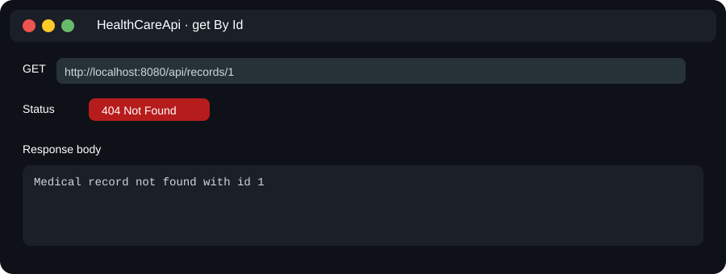

# HealthCare-API


This API is made to support a simple healthcare management system. The main purpose is to help organize patient-related information in one place so that doctors, appointments, bills, prescriptions, and medical records can be handled through backend services.

Some of the main use cases of this API are:

- registering new patients and storing their basic information
- adding doctors to the system
- booking and managing appointments between patients and doctors
- creating billing records for appointments or treatments
- saving prescription details for patients
- keeping medical records in a structured way

This project is useful for understanding how a healthcare-related backend can be built in a simple and beginner-friendly way. It is built using Spring Boot and follows a basic controller-service-repository structure.

## Tools, tech stack, and framework used in these use cases

For this healthcare API, I used a simple set of tools and technologies that helped me build the backend in a clean way:

- Java as the main programming language
- Spring Boot as the main framework to create the API quickly
- Spring MVC for building REST controllers
- Spring Data JPA for database connection and CRUD operations
- MySQL as the database to store healthcare data
- Maven for project build and dependency management
- Lombok to reduce repetitive code
- Validation to check incoming data
- Swagger/OpenAPI to document and test the APIs

These tools work together to support the main use cases of patient registration, doctor management, appointment booking, billing, prescription handling, and medical record storage.

## Project structure

Here is the simple folder structure I used:

- controller: all API endpoints are written here
- service: business logic is handled here
- repository: database operations are written here
- entity: database models are written here
- exceptionhandler: custom exception handling
- dto: data transfer objects

## Technologies used

- Java
- Spring Boot
- Spring Data JPA
- MySQL
- Maven
- Lombok
- Validation
- Swagger/OpenAPI

## How to run the project

1. Make sure Java and Maven are installed on your system.
2. Open the project in your IDE.
3. Make sure MySQL is running.
4. Create a database named Healthcaredb.
5. Update your database username and password in the application properties file if needed.
6. Run the project with:

```bash
./mvnw spring-boot:run
```

If everything is set up correctly, the app should start on port 8080.

## Database configuration

The project uses MySQL by default. The connection details are stored in:

- src/main/resources/application.properties

The current setup expects:

- database name: Healthcaredb
- username: root
- password: 123456

If your local MySQL username or password is different, change those values in the properties file.

## API endpoints

The application has REST endpoints for the following modules:

### Patients

- GET /api/patients
- GET /api/patients/{id}
- POST /api/patients
- PUT /api/patients/{id}
- DELETE /api/patients/{id}

### Doctors

- GET /api/doctors
- GET /api/doctors/{id}
- POST /api/doctors
- PUT /api/doctors/{id}
- DELETE /api/doctors/{id}

### Appointments

- GET /api/appointments
- GET /api/appointments/{id}
- POST /api/appointments
- PUT /api/appointments/{id}
- DELETE /api/appointments/{id}

### Billing

- GET /api/billing
- GET /api/billing/{id}
- POST /api/billing
- PUT /api/billing/{id}
- DELETE /api/billing/{id}

### Prescriptions

- GET /api/prescriptions
- GET /api/prescriptions/{id}
- POST /api/prescriptions
- PUT /api/prescriptions/{id}
- DELETE /api/prescriptions/{id}

### Medical Records

- GET /api/records
- GET /api/records/{id}
- POST /api/records
- PUT /api/records/{id}
- DELETE /api/records/{id}

## Swagger / API documentation

I also added Swagger support, so I can test the APIs through the browser.

After running the application, open:

- http://localhost:8080/swagger-ui/index.html

This makes it easier to check the endpoints without using Postman every time.

## Notes on how to use the API calls

Here are a few simple notes that may help when testing the API:

- Start the application first and make sure the server is running on port 8080.

- Use the correct endpoint for the module you want to test, such as patients, doctors, appointments, or billing.

- For POST and PUT requests, send data in JSON format in the request body.

- For GET requests, you can open the URL directly in the browser or use Postman.

- For update and delete requests, use the ID of the item you want to change or remove.

- If you get an error, check whether the database is running and whether the required table data exists.

- Swagger UI is a good place to try the endpoints quickly without writing too much request setup.

## API response example

The screenshot below shows the `GET /api/records/1` call when the record does not exist. This is a useful test for the API response flow because it shows how the app responds to a missing medical record.

- URL: `http://localhost:8080/api/records/1`
- Use case: get medical record details by id
- Response: `404 Not Found`
- Response body: `Medical record not found with id 1`



## Example of how I tested the app

I tested the APIs using:

- Postman
- Swagger UI
- browser requests while the application was running

If I want to improve this project later, I would like to add:

- user authentication

- better validation messages

- more detailed exception handling

- frontend connection

- search and filter features